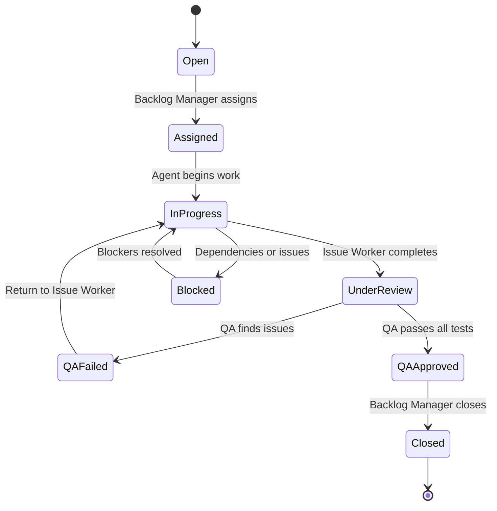

# Agent Coordination Workflow Documentation

## Overview
This document defines the coordination protocols, communication standards, and workflow orchestration for the 4-agent system managing the Starterkit Angular application backlog.

## Agent Hierarchy & Responsibilities

### 🎯 Backlog Manager Agent (Orchestrator)
- **Role**: Project coordinator and workflow orchestrator
- **Authority**: Assigns work, resolves conflicts, makes priority decisions
- **Communication**: Interfaces with all agents and external stakeholders
- **Scope**: Full backlog visibility and resource allocation (~10 issues)

### 🔬 Research Agent (Knowledge Specialist)
- **Role**: Research and analysis specialist
- **Authority**: Knowledge domain expert, research methodology decisions
- **Communication**: Reports to Backlog Manager, coordinates with Issue Worker for implementation
- **Scope**: Issues labeled "Research" and template/feature analysis tasks

### 👨‍💻 Issue Worker Agent (Primary Executor)
- **Role**: Code implementation and development
- **Authority**: Technical implementation decisions within assigned issues
- **Communication**: Reports to Backlog Manager, hands off to QA Agent
- **Scope**: Development, bug fixes, template implementation, documentation

### 🧪 QA/Testing Agent (Quality Guardian)
- **Role**: Quality assurance and comprehensive testing
- **Authority**: Quality standards enforcement, approval/rejection of implementations
- **Communication**: Receives handoffs from Issue Worker, reports to Backlog Manager
- **Scope**: All testing, validation, and quality assurance activities

## Workflow State Machine

### Issue Lifecycle States
1. **Open** → Unassigned issue in backlog
2. **Assigned** → Agent has been assigned to issue
3. **In Progress** → Agent actively working on issue
4. **Under Review** → QA Agent testing implementation
5. **QA Failed** → Issues found, returned to Issue Worker Agent
6. **QA Approved** → Quality gates passed, ready for closure
7. **Closed** → Issue completed and validated

### State Transitions



## Communication Protocols

### 1. Standard Communication Channels

#### GitHub Issues (Primary Channel)
```bash
# Standard comment format for status updates
gh issue comment {issue_number} --body "
**Agent:** [Agent Name]
**Status:** [Current State]
**Progress:** [Description of current work]
**ETA:** [Expected completion time]
**Blockers:** [Any impediments]
**Next Steps:** [Planned activities]
"
```

#### Issue Labels for Status Tracking
- `assigned-research` - Research Agent working
- `assigned-development` - Issue Worker Agent working
- `assigned-qa` - QA Agent testing
- `in-progress` - Active development
- `qa-ready` - Ready for QA testing
- `qa-failed` - QA found issues
- `qa-approved` - QA approved for closure
- `blocked` - Cannot proceed due to dependencies

### 2. Agent-to-Agent Communication

#### Research Agent → Issue Worker Agent Handoff
```bash
# Research complete, implementation needed
gh issue comment {issue_number} --body "
@Issue-Worker-Agent - Research findings complete and ready for implementation.

**Research Summary:**
- [Key findings]
- [Implementation recommendations]
- [Technical specifications]

**Deliverables:**
- Research report: [link/attachment]
- Requirements document: [link/attachment]
- Technical specifications: [link/attachment]

**Implementation Notes:**
- [Specific technical guidance]
- [Dependencies to consider]
- [Performance requirements]

Please confirm receipt and provide implementation timeline.
"

# Update labels
gh issue edit {issue_number} --remove-label "assigned-research" --add-label "assigned-development"
```

#### Issue Worker Agent → QA Agent Handoff
```bash
# Implementation complete, testing needed
gh issue comment {issue_number} --body "
@QA-Agent - Implementation complete and ready for comprehensive testing.

**Implementation Summary:**
- [Description of changes made]
- [Files modified]
- [Features added/bugs fixed]

**Testing Completed:**
- [x] Unit tests passing
- [x] Lint checks passing
- [x] Build successful
- [x] Basic manual testing

**QA Focus Areas:**
- [Specific components to test]
- [Browser compatibility requirements]
- [Accessibility considerations]
- [Performance benchmarks]

**Demo Instructions:**
1. npm run start
2. Navigate to: [specific demo page/component]
3. Test scenarios: [detailed test cases]

**Files Changed:**
- [List of modified files with brief description]

Branch: issue-{issue_number}-[description]
Build Status: ✅ Passing
"

# Update labels
gh issue edit {issue_number} --remove-label "assigned-development" --add-label "qa-ready"
```

#### QA Agent → Backlog Manager Agent Completion
```bash
# QA approved, ready for closure
gh issue comment {issue_number} --body "
@Backlog-Manager-Agent - QA testing complete and approved for closure.

**QA Results:**
- [x] All test cases passed
- [x] Cross-browser compatibility verified
- [x] Accessibility compliance (WCAG 2.1 AA)
- [x] Performance benchmarks met
- [x] Integration testing successful

**Quality Metrics:**
- Test Coverage: [XX%]
- Performance Score: [XX/100]
- Accessibility Score: [XX/100]
- Browser Support: [List of tested browsers]

**Final Validation:**
- [x] Angular 19 and DLS consumer standards compliance
- [x] Documentation updated
- [x] Change log entries added
- [x] No regression issues detected

This issue is approved for closure and ready for release.
"

# Update labels
gh issue edit {issue_number} --remove-label "qa-ready" --add-label "qa-approved"
```

### 3. Escalation Procedures

#### Level 1: Agent-to-Agent Resolution
```bash
# When agents need to coordinate directly
gh issue comment {issue_number} --body "
@[Target-Agent] - Need coordination on shared dependency/conflict.

**Issue:** [Description of conflict/dependency]
**Impact:** [How it affects current work]
**Proposed Resolution:** [Suggested solution]
**Timeline:** [When resolution is needed]

Please respond with your preferred approach.
"
```

#### Level 2: Backlog Manager Intervention
```bash
# When Level 1 doesn't resolve within 24 hours
gh issue comment {issue_number} --body "
@Backlog-Manager-Agent - Escalating coordination issue requiring intervention.

**Agents Involved:** [List of agents]
**Conflict Description:** [Detailed description]
**Business Impact:** [Effect on deliverables/timeline]
**Attempted Resolutions:** [Previous attempts]
**Requested Decision:** [What needs to be decided]

Immediate resolution requested to prevent project delays.
"
```

#### Level 3: Project Stakeholder Escalation
```bash
# When technical/business decisions exceed agent authority
gh issue comment {issue_number} --body "
**ESCALATION TO PROJECT STAKEHOLDERS**

**Issue Classification:** [Technical/Business/Resource]
**Severity:** [Critical/High/Medium]
**Description:** [Detailed problem description]
**Stakeholders Needed:** [Who needs to be involved]
**Decision Required:** [What needs to be decided]
**Timeline Impact:** [Effect on project deliverables]

@project-lead @team-lead - Please review and provide guidance.
"
```

## Conflict Resolution Framework

### 1. Resource Conflicts (Multiple agents need same files)

#### Detection
```bash
# Backlog Manager monitors for conflicts
gh pr list --state open
git log --oneline --graph --all  # Check for concurrent work
```

#### Resolution Protocol
1. **Immediate Pause**: Stop all conflicting work
2. **Priority Assessment**: Determine which issue has higher priority
3. **Coordination Meeting**: Virtual sync between affected agents
4. **Sequencing Decision**: Determine order of implementation
5. **Timeline Adjustment**: Update project schedules accordingly

#### Communication Template
```bash
gh issue comment {issue_number} --body "
**RESOURCE CONFLICT DETECTED**

**Conflicting Issues:** #{issue1}, #{issue2}
**Shared Resources:** [List of conflicting files/components]
**Agents Involved:** [Agent names]

**Resolution:**
- Primary Work: Issue #{priority_issue} (Agent: [name])
- Secondary Work: Issue #{secondary_issue} - PAUSED until primary complete
- Expected Resolution: [timeline]

All affected agents please confirm understanding and adjust plans accordingly.
"
```

### 2. Dependency Conflicts (Work blocked by other work)

#### Dependency Mapping
```bash
# Track issue dependencies
gh issue view {issue_number}  # Check linked issues
# Look for "depends on", "blocks", "related to" relationships
```

#### Resolution Process
1. **Dependency Analysis**: Map all issue relationships
2. **Critical Path Identification**: Find shortest path to completion
3. **Work Reordering**: Adjust priorities based on dependencies
4. **Timeline Recalculation**: Update all affected schedules
5. **Stakeholder Communication**: Inform about timeline changes

### 3. Quality Standard Conflicts (QA vs. Timeline pressure)

#### Escalation Trigger
- QA Agent finds critical issues but timeline pressure exists
- Issue Worker Agent disputes QA findings
- Performance/quality tradeoff decisions needed

#### Resolution Framework
1. **Impact Assessment**: Quantify quality vs. timeline tradeoffs
2. **Stakeholder Consultation**: Involve project leadership
3. **Risk Analysis**: Document potential consequences
4. **Decision Documentation**: Record rationale for future reference
5. **Mitigation Planning**: Plan for addressing deferred quality issues

## Performance Monitoring & Metrics

### 1. Agent Performance Indicators

#### Backlog Manager Agent KPIs
- **Issue Assignment Speed**: Time from open to assigned
- **Workflow Efficiency**: Issues completed per sprint
- **Conflict Resolution**: Time to resolve agent conflicts
- **Stakeholder Satisfaction**: Feedback scores from project team

#### Research Agent KPIs
- **Research Quality**: Actionability of recommendations
- **Timeline Adherence**: On-time delivery of research
- **Implementation Success**: How often research leads to successful implementations
- **Knowledge Reuse**: Research artifacts used in multiple templates/features

#### Issue Worker Agent KPIs
- **Development Velocity**: Issues completed per sprint
- **Code Quality**: Test coverage and lint compliance
- **First-Pass Success**: Issues passing QA on first attempt
- **Technical Debt**: Regression issues caused by implementations

#### QA Agent KPIs
- **Defect Detection**: Bugs found before release
- **Testing Efficiency**: Time from handoff to approval/rejection
- **Quality Standards**: Compliance with Angular 19 and DLS consumer standards
- **User Impact**: Post-deployment defect rates

### 2. Workflow Health Monitoring

#### Daily Health Checks
```bash
# Backlog Manager runs these daily
gh issue list --state open --sort created-asc  # Check aging issues
gh issue list --label "blocked" --state open   # Monitor blockers
gh issue list --label "qa-failed" --state open # Track quality issues

# Daily trend analysis (smaller backlog)
gh issue list --state closed --search "closed:>$(date -d '2 days ago' '+%Y-%m-%d')"
```

#### Workflow Bottleneck Detection
1. **Queue Analysis**: Monitor work queues for each agent
2. **Throughput Tracking**: Issues completed vs. issues assigned
3. **Cycle Time Monitoring**: Time from assignment to completion
4. **Quality Metrics**: QA pass/fail rates and rework frequency

### 3. Continuous Improvement Process

#### Bi-weekly Retrospectives
```bash
# Generate retrospective report
gh issue list --state closed --search "closed:>$(date -d '2 weeks ago' '+%Y-%m-%d')" > biweekly-completed.txt
gh issue list --label "qa-failed" --search "updated:>$(date -d '2 weeks ago' '+%Y-%m-%d')" > biweekly-qa-issues.txt
```

#### Weekly Process Reviews
- **Workflow Efficiency Analysis**: Identify bottlenecks and improvement opportunities
- **Agent Performance Review**: Individual and team performance assessment
- **Process Optimization**: Updates to coordination protocols
- **Tool Evaluation**: Assessment of supporting tools and automation

## Emergency Response Procedures

### 1. Critical Production Issue
```bash
# Immediate response protocol
gh issue create --title "CRITICAL: [Description]" --label "critical,emergency" --assignee "backlog-manager"

# All agents notified immediately
# Issue Worker Agent: Drop current work, focus on fix
# QA Agent: Expedited testing protocols (within 2-4 hours)
# Research Agent: Pause research, provide immediate support if needed
```

### 2. Build System Failure
```bash
# System-wide halt protocol
# 1. All agents pause current work
# 2. Issue Worker Agent investigates build failure
# 3. Backlog Manager coordinates infrastructure resolution
# 4. QA Agent prepares for rapid validation once fixed
```

### 3. Agent Unavailability
```bash
# Continuity protocols
# Research Agent unavailable: Issue Worker can proceed with existing research
# Issue Worker unavailable: Backlog Manager reassigns critical issues to next available resource
# QA Agent unavailable: Issue Worker performs enhanced self-testing
# Backlog Manager unavailable: Senior team member takes coordination role
```

## Success Metrics & Reporting

### Daily Dashboard Metrics
- **Velocity**: Issues closed per agent per day
- **Quality**: QA pass rate on first attempt
- **Efficiency**: Average cycle time from assignment to completion
- **Collaboration**: Successful handoffs without escalation

### Weekly Project Summary
- **Backlog Health**: Total open issues, age distribution, priority breakdown
- **Team Performance**: Individual agent performance metrics
- **Quality Trends**: Defect rates, user satisfaction scores
- **Process Improvements**: Changes made to increase efficiency

### Monthly Strategic Review
- **Goal Achievement**: Progress toward project milestones
- **Process Maturity**: Evolution of coordination effectiveness
- **Resource Optimization**: Agent workload distribution and efficiency
- **Stakeholder Satisfaction**: Feedback from project stakeholders

## Conclusion

This coordination framework ensures efficient, high-quality delivery of Starterkit Angular application enhancements while maintaining clear communication, preventing conflicts, and enabling rapid response to urgent needs. Regular monitoring and continuous improvement keep the process optimized for team success.