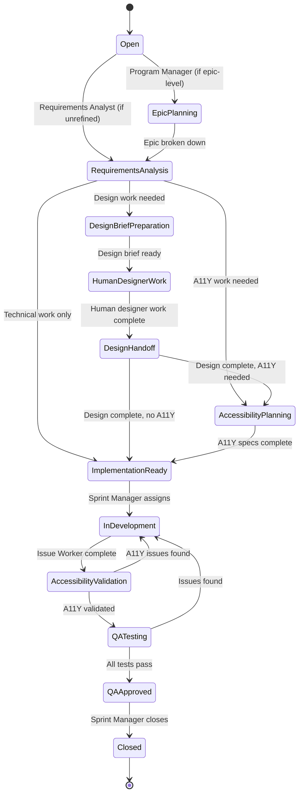

# Enhanced 7-Agent Coordination Workflow

## Overview
This document defines the coordination protocols, communication standards, and workflow orchestration for the enhanced 7-agent system managing the Boeing DLS Global Angular Component Library's 129-issue backlog with program and sprint-level management.

## Agent Hierarchy & Responsibilities

### **Strategic Layer (Program Management)**

#### 🎯 **Program Manager Agent** (Strategic Orchestrator)
- **Role**: Epic planning, milestone coordination, stakeholder management
- **Authority**: Program-level decisions, epic prioritization, resource allocation
- **Scope**: All 28 epics including Atmosphere 2.0 initiative, AI integration, infrastructure programs
- **Communication**: Boeing leadership, cross-epic coordination, quarterly planning

### **Analysis Layer (Requirements & Design)**

#### 🔬 **Requirements Analyst Agent** (Issue Refinement)
- **Role**: Analyze 38 unrefined issues, gather requirements, stakeholder research
- **Authority**: Requirements specification, feasibility assessment, stakeholder interviews
- **Scope**: Transform unrefined issues into actionable specifications for other agents
- **Communication**: Stakeholders, business analysis, handoff to specialist agents

#### 🎨 **Design Coordinator Agent** (Human Designer Coordination)
- **Role**: Coordinate human designer workflows, design brief preparation, design handoff management
- **Authority**: Design workflow coordination, human designer capacity planning, design specification handoffs
- **Scope**: All design coordination across epics, human designer brief preparation, design system coordination
- **Communication**: Design brief coordination, human designer handoffs, design specification delivery

**Important**: Design Coordinator Agent coordinates human designers but cannot create Figma designs, visual assets, or make design decisions. All actual design work is performed by human designers.

#### ♿ **Accessibility Specialist Agent** (Inclusive Design & WCAG Compliance)
- **Role**: WCAG 2.1 AA compliance, assistive technology compatibility, inclusive design
- **Authority**: Accessibility standards enforcement, WCAG interpretation, AT testing
- **Scope**: All accessibility requirements across all components and features
- **Communication**: Accessibility specifications, compliance validation, remediation plans

### **Execution Layer (Implementation & Validation)**

#### 👨‍💻 **Issue Worker Agent** (Pure Implementation)
- **Role**: Code implementation based on complete specifications from other agents
- **Authority**: Technical implementation decisions within specified requirements
- **Scope**: Pure coding work with complete requirements, design, and accessibility specs
- **Communication**: Implementation status, technical clarifications, code delivery

#### 🧪 **QA/Testing Agent** (Functional & Performance Testing)
- **Role**: Comprehensive testing after implementation and accessibility validation
- **Authority**: Quality standards enforcement, test strategy decisions
- **Scope**: Functional, integration, performance, and cross-browser testing
- **Communication**: Test results, quality validation, approval for release

#### 🔬 **Research Agent** (Knowledge & Investigation)
- **Role**: Systematic research, analysis, and knowledge synthesis (unchanged from 4-agent system)
- **Authority**: Research methodology, findings synthesis
- **Scope**: 9 research issues, investigation tasks, knowledge compilation
- **Communication**: Research findings, recommendations, knowledge transfer

### **Coordination Layer (Tactical Management)**

#### 📋 **Sprint Manager Agent** (Tactical Coordinator)
- **Role**: Day-to-day sprint coordination, agent workload balancing, PR queue management
- **Authority**: Sprint-level task assignment, tactical coordination decisions
- **Scope**: Sprint planning, daily coordination, agent capacity management
- **Communication**: Daily coordination, sprint planning, tactical issue resolution

## Enhanced Workflow State Machine

### Issue Lifecycle States (Updated for 7-Agent System)
1. **Open** → New issue in backlog
2. **Epic Planning** → Program Manager analysis (for epic-level work)
3. **Requirements Analysis** → Requirements Analyst investigation
4. **Design Brief Preparation** → Design Coordinator Agent prepares briefs for human designers
5. **Human Designer Work** → Human designers create Figma designs and specifications
6. **Design Handoff** → Design Coordinator Agent delivers human designer specifications
7. **Accessibility Planning** → Accessibility Specialist requirements (if accessibility work needed)
8. **Implementation Ready** → All specifications complete
9. **In Development** → Issue Worker Agent implementing
10. **Accessibility Validation** → Accessibility Specialist testing implementation
11. **QA Testing** → QA Agent comprehensive testing
12. **QA Approved** → Ready for closure
13. **Closed** → Complete and validated

### Enhanced State Transitions



## Enhanced Communication Protocols

### **Strategic-Level Communication (Program Manager)**

#### **Epic Planning Communication**
```bash
# Program Manager coordinates epic-level work
gh issue comment {epic_issue} --body "
## Epic Planning: #{epic_number} - {Epic Name}

**Program Priority**: [High/Medium/Low based on strategic goals]
**Epic Scope**: [High-level scope and objectives]
**Dependencies**: [Cross-epic dependencies identified]
**Resource Requirements**: [Agent specializations needed]

### Epic Breakdown Assignment
@Requirements-Analyst-Agent - Epic analysis needed:
- Break down epic into actionable issues
- Identify stakeholder research requirements
- Define technical feasibility scope
- Provide effort estimation for planning

**Timeline**: [Expected completion for epic breakdown]
**Program Context**: [How this fits into broader program goals]

Epic assigned for requirements analysis and breakdown.
"
```

#### **Program Coordination Communication**
```bash
# Program Manager coordinates across multiple agents for complex epics
gh issue comment {coordination_issue} --body "
## Program Coordination: Atmosphere 2.0 Component - {Component Name}

**Multi-Agent Coordination Required**:

@Requirements-Analyst-Agent:
- [ ] Requirements analysis complete - [Timeline]
- [ ] Stakeholder interviews conducted
- [ ] Technical feasibility confirmed

@Design-Coordinator-Agent:
- [ ] Design brief preparation ready - [Timeline]
- [ ] Human designer coordination complete
- [ ] Human designer deliverables received (Figma components, specifications)
- [ ] Design system integration confirmed with human designer work
- [ ] Dependencies: Requirements analysis completion

@Accessibility-Specialist-Agent:
- [ ] Accessibility requirements defined - [Timeline]
- [ ] WCAG compliance plan ready
- [ ] Dependencies: Human designer specifications completion (via Design Coordinator Agent)

@Sprint-Manager-Agent:
- [ ] Sprint coordination ready when all specs complete
- [ ] Agent capacity planning for implementation phase

**Program Dependencies**: [Other epics this affects or depends on]
**Strategic Importance**: [Why this epic matters for Boeing DLS program]

Coordinated multi-agent work beginning.
"
```

### **Analysis-Level Communication (Requirements, Design, Accessibility)**

#### **Requirements Analysis Handoff**
```bash
# Requirements Analyst to Design/UX handoff
gh issue comment {issue_number} --body "
## Requirements → Design Handoff

@Design-UX-Agent - Requirements analysis complete, design work needed

**Requirements Summary**:
- Functional requirements: [Summary of what needs to be built]
- User experience requirements: [UX needs identified through stakeholder research]
- Technical constraints: [Limitations that affect design decisions]
- Business requirements: [Strategic business needs]

**Design Scope Identified**:
- [ ] Visual design specifications needed
- [ ] Interaction patterns to be defined
- [ ] Responsive behavior requirements
- [ ] Design system integration points
- [ ] Figma component creation required

**Stakeholder Context**: [Key stakeholder feedback relevant to design]
**Success Criteria**: [How design success will be measured]

**Handoff Deliverables**:
- Complete requirements specification document
- Stakeholder research findings
- Technical feasibility analysis
- Design constraints documentation

Ready for design development phase.
"
```

#### **Design to Accessibility Handoff**
```bash
# Design/UX to Accessibility handoff
gh issue comment {issue_number} --body "
## Design → Accessibility Integration

@Accessibility-Specialist-Agent - Design specifications complete, accessibility integration needed

**Design Deliverables**:
- Figma design specifications: [Link to designs]
- Interaction patterns defined: [Interaction design details]
- Visual specifications: [Colors, typography, spacing details]
- Responsive behavior: [Multi-device design requirements]

**Accessibility Integration Points**:
- [ ] Color contrast validation needed
- [ ] Focus indicator design review
- [ ] Screen reader experience design
- [ ] Keyboard navigation pattern specification
- [ ] ARIA implementation planning

**Design Constraints Affecting Accessibility**:
- [Any design decisions that impact accessibility implementation]

**Collaboration Required**:
- Accessibility feedback may require design iterations
- Joint validation of accessible design patterns

Ready for accessibility requirements specification.
"
```

### **Implementation-Level Communication (Sprint Manager, Issue Worker, QA)**

#### **Sprint Assignment Communication**
```bash
# Sprint Manager to Issue Worker assignment
gh issue comment {issue_number} --body "
## Sprint Assignment: Implementation Ready

@Issue-Worker-Agent - Issue ready for implementation

**Implementation Package Complete**:
- [x] Requirements specification (Requirements Analyst Agent)
- [x] Design specifications (Design/UX Specialist Agent)
- [x] Accessibility requirements (Accessibility Specialist Agent)
- [x] Sprint capacity confirmed
- [x] Dependencies resolved

**Implementation Scope**:
- Technical development: [Specific coding work needed]
- Design implementation: [Design specifications to implement]
- Accessibility implementation: [WCAG requirements to code]
- Testing requirements: [Self-testing expectations]

**Quality Gates**:
- [ ] All automated tests pass
- [ ] Design implementation matches specifications
- [ ] Accessibility features implemented per requirements
- [ ] Code follows Boeing DLS standards

**Timeline**: [Expected completion date]
**Sprint Context**: [How this fits into current sprint goals]

Implementation assignment confirmed - ready to begin development.
"
```

#### **Implementation to QA Handoff**
```bash
# Issue Worker to QA handoff (after accessibility validation)
gh issue comment {issue_number} --body "
## Implementation → QA Testing Handoff

@QA-Agent - Implementation complete and accessibility validated, ready for comprehensive testing

**Implementation Summary**:
- Features implemented: [Specific functionality delivered]
- Design specifications implemented: [Visual and interaction features]
- Accessibility features implemented: [WCAG compliance features]
- Self-testing completed: [Basic validation performed]

**Accessibility Validation Status**:
- [x] Accessibility Specialist Agent validation complete
- [x] WCAG 2.1 AA compliance confirmed
- [x] Screen reader testing passed
- [x] Keyboard navigation validated

**QA Testing Scope**:
- [ ] Functional testing across all use cases
- [ ] Integration testing with other components
- [ ] Cross-browser compatibility validation
- [ ] Performance testing and regression validation
- [ ] User workflow testing

**Testing Environment**:
- Branch: implement-{issue_number}-{description}
- Demo URL: [Link to demo implementation]
- Test data: [Any specific test data requirements]

Ready for comprehensive QA validation.
"
```

### **Validation-Level Communication (Accessibility, QA to Sprint Manager)**

#### **QA Approval Communication**
```bash
# QA Agent final approval
gh issue comment {issue_number} --body "
## QA Validation Complete - Ready for Closure

@Sprint-Manager-Agent - Comprehensive testing complete, ready for issue closure

**QA Testing Results**:
- [x] All functional tests passed
- [x] Cross-browser compatibility confirmed
- [x] Integration testing successful
- [x] Performance benchmarks met
- [x] Regression testing passed

**Quality Metrics Achieved**:
- Functional test coverage: [X]%
- Performance score: [X]/100
- Cross-browser compatibility: [List of validated browsers]
- Zero critical or high-priority issues found

**Accessibility Validation Confirmed**:
- [x] WCAG 2.1 AA compliance maintained through QA testing
- [x] No functional issues affect accessibility
- [x] Accessibility features work correctly with all functionality

**Release Readiness**:
- [x] All acceptance criteria met
- [x] No blocking issues identified
- [x] Boeing DLS quality standards satisfied
- [x] Ready for production deployment

Issue approved for closure and release.
"
```

## Enhanced Conflict Resolution Framework

### **Multi-Agent Conflict Resolution**

#### **Cross-Specialization Conflicts**
```bash
# When specialist agents have conflicting requirements
gh issue comment {conflict_issue} --body "
## Cross-Agent Conflict Resolution Required

**Conflict Type**: Requirements vs Design vs Accessibility
**Agents Involved**: [List affected agents]
**Issue Description**: [Specific conflict details]

**Conflict Details**:
- Requirements Agent finding: [Requirement that creates conflict]
- Design Agent recommendation: [Design approach that conflicts]
- Accessibility Agent requirement: [Accessibility need that conflicts]

**Business Impact**: [How conflict affects Boeing DLS goals]
**Timeline Impact**: [Effect on delivery schedules]

**Resolution Needed From**:
- [ ] Program Manager Agent - Strategic decision required
- [ ] Boeing Stakeholders - Business priority clarification
- [ ] Technical Architecture - Technical constraint resolution

**Proposed Resolution Options**:
1. [Option 1 with tradeoffs]
2. [Option 2 with tradeoffs]
3. [Option 3 with tradeoffs]

Escalating for program-level resolution.
"
```

#### **Capacity Conflicts**
```bash
# When multiple agents are overloaded
gh issue comment {capacity_issue} --body "
## Agent Capacity Conflict - Resource Reallocation Needed

**Capacity Analysis**:
- Requirements Analyst Agent: [X] issues, [Y] estimated days
- Design/UX Specialist Agent: [X] issues, [Y] estimated days
- Accessibility Specialist Agent: [X] issues, [Y] estimated days
- Issue Worker Agent: [X] issues, [Y] estimated days

**Bottleneck Identified**: [Which agent(s) are overloaded]
**Program Impact**: [Effect on program milestones]

**Reallocation Options**:
1. **Prioritization**: Delay lower-priority work
2. **Batching**: Combine related work for efficiency
3. **Process Optimization**: Streamline handoff processes
4. **Resource Augmentation**: Additional capacity needed

@Program-Manager-Agent - Program-level capacity planning needed
"
```

## Enhanced Quality Gates & Success Metrics

### **Program-Level Quality Gates**
- **Epic Completion Rate**: >85% of planned epics completed per quarter
- **Cross-Agent Coordination**: <5% of issues blocked by inter-agent dependencies
- **Stakeholder Satisfaction**: >90% satisfaction with program progress
- **Quality Standards**: 100% WCAG 2.1 AA compliance, >90% first-pass QA approval

### **Sprint-Level Quality Gates**
- **Issue Flow Efficiency**: <48 hours average between agent handoffs
- **Agent Capacity Utilization**: 80-90% optimal utilization across all agents
- **PR Queue Management**: <5 PRs pending human review at any time
- **Quality First-Pass Rate**: >80% of implementations pass QA on first attempt

### **Agent-Specific Success Metrics**

#### **Requirements Analyst Agent**
- Requirements clarity: >95% of refined issues require no re-analysis
- Stakeholder satisfaction: >90% approval of requirements specifications
- Analysis efficiency: 2-5 days per unrefined issue (complexity-dependent)

#### **Design/UX Specialist Agent**
- Design implementation accuracy: >95% fidelity from design to code
- Figma workflow efficiency: 3-5 days per component design
- Design system contribution: >80% use of approved design tokens

#### **Accessibility Specialist Agent**
- WCAG compliance: 100% WCAG 2.1 AA compliance across all work
- Accessibility integration: >90% accessibility issues prevented through proactive design/development
- User satisfaction: >4.5/5 satisfaction from users with disabilities

## Enhanced Emergency Response Procedures

### **Multi-Agent Crisis Response**
```bash
# Program-level crisis affecting multiple agents
gh issue create --title "MULTI-AGENT CRISIS: [Crisis Description]" --body "
🚨 **MULTI-AGENT COORDINATION CRISIS**

**Crisis Type**: [Technical/Process/Resource/Strategic]
**Agents Affected**: [List all affected agents]
**Program Impact**: [Effect on program milestones and deliverables]

## Immediate Response Coordination

**Program Manager**:
- [ ] Assess strategic impact and communicate with Boeing leadership
- [ ] Redefine program priorities if needed
- [ ] Coordinate with Sprint Manager on tactical response

**Sprint Manager**:
- [ ] Pause current sprint work in affected areas
- [ ] Reallocate agent capacity to crisis response
- [ ] Coordinate tactical response across agents

**Affected Specialist Agents**:
- [ ] Drop non-critical work to focus on crisis response
- [ ] Coordinate specialized response based on agent expertise
- [ ] Provide rapid assessment of crisis impact in their domain

**Communication Protocol**:
- Immediate: All agents acknowledge crisis within 2 hours
- Daily: Crisis response status updates every 24 hours
- Resolution: Post-crisis retrospective and process improvements

Crisis response activated - all non-essential work paused.
"
```

## Continuous Improvement Framework

### **7-Agent System Health Monitoring**
```bash
# Weekly system health assessment
gh issue create --title "7-Agent System Health Check - Week of $(date)" --body "
## Multi-Agent System Performance Analysis

### Agent Workload Distribution
- Program Manager Agent: [Strategic work load assessment]
- Requirements Analyst Agent: [Analysis pipeline health]
- Design/UX Specialist Agent: [Design workflow efficiency]
- Accessibility Specialist Agent: [Accessibility integration success]
- Issue Worker Agent: [Implementation capacity and quality]
- QA/Testing Agent: [Testing throughput and effectiveness]
- Research Agent: [Research project progress]
- Sprint Manager Agent: [Coordination effectiveness]

### Inter-Agent Coordination Health
**Handoff Efficiency**: [Average time between agent handoffs]
**Communication Quality**: [Clarity and completeness of agent communication]
**Conflict Resolution**: [Speed and effectiveness of conflict resolution]
**Capacity Balancing**: [How well workload is distributed]

### Process Improvements Identified
**Workflow Optimizations**: [Process improvements to implement]
**Communication Enhancements**: [Better coordination methods]
**Tool Improvements**: [Better tools or automation opportunities]
**Training Needs**: [Agent capability improvements needed]

### Success Metrics Trends
**Velocity**: [Issues completed per agent per week]
**Quality**: [First-pass success rates by agent]
**Satisfaction**: [Stakeholder feedback trends]
**Coordination**: [Cross-agent collaboration effectiveness]

**System Health Status**: [Excellent/Good/Needs Improvement/Critical]
" --label "system-health-check"
```

This enhanced 7-agent coordination framework transforms your 129-issue backlog from an overwhelming challenge into a manageable, specialized workflow where each agent has clear expertise and coordination protocols ensure smooth collaboration toward delivering high-quality Boeing DLS components.